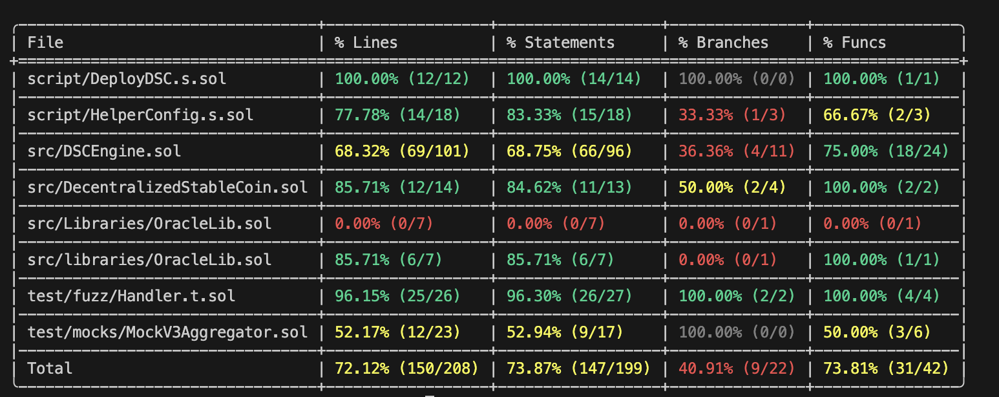
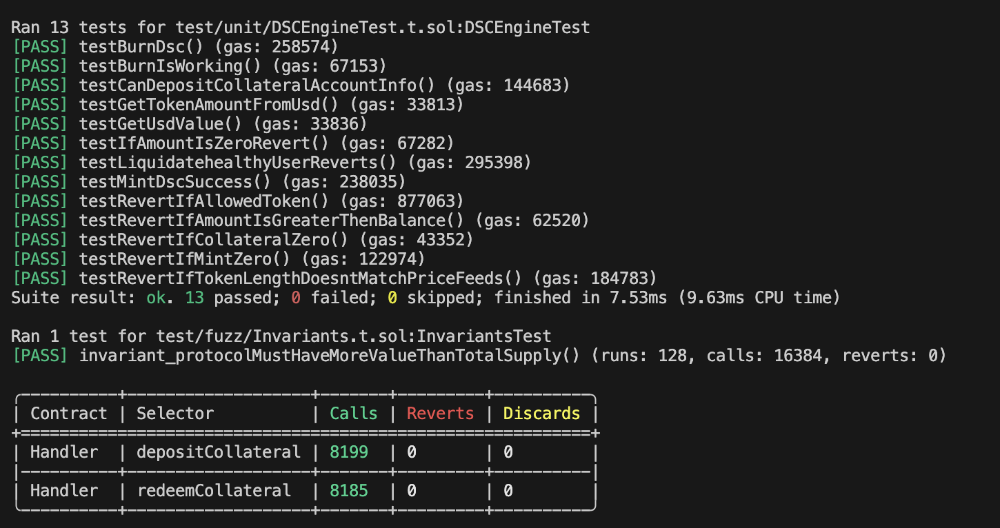

## 🛠 Tech Stack
- **Solidity (^0.8.18)**
- **Foundry (Forge, Cast, Anvil)**
- OpenZeppelin Contracts

---

## 📊 Test Coverage
70% coverage achieved using Foundry.  
```bash

## Test Coverage Screenshots  

<p align="center">
  
  
</p>

